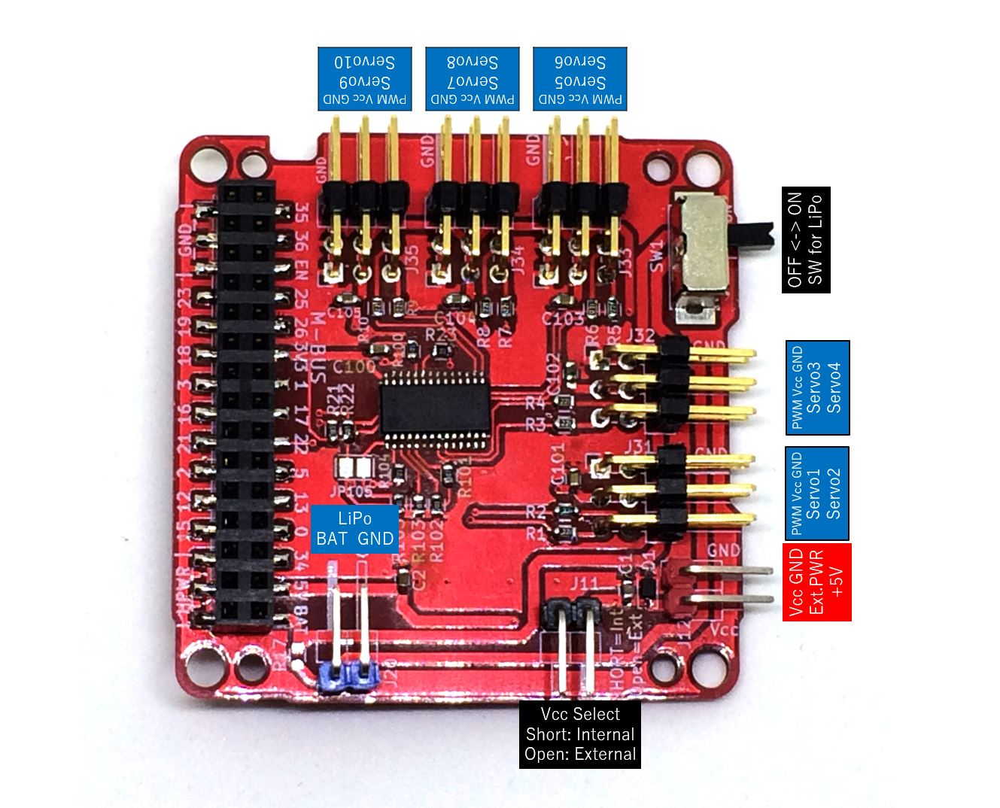
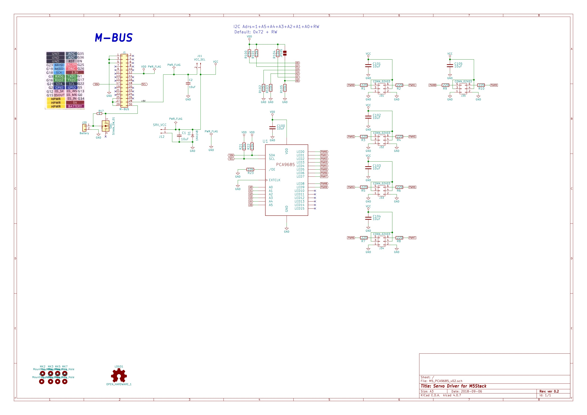

# M5Stack_Servo_Driver

PCA9685 Servo Driver Shield for M5Stack

## Schematics

## Servo Driver: PCA9685 (NXP Semiconductors)
[Datasheet](https://www.nxp.com/docs/en/data-sheet/PCA9685.pdf)

## Arduino IDE Library (Adafruit-PWM-Servo-Driver)
[Adafruit-PWM-Servo-Driver](https://github.com/adafruit/Adafruit-PWM-Servo-Driver-Library)

**Change I2C address to 0x72**

## Example
M5Stack_Plotclock

https://github.com/tomorrow56/M5Stack_Plotclock
